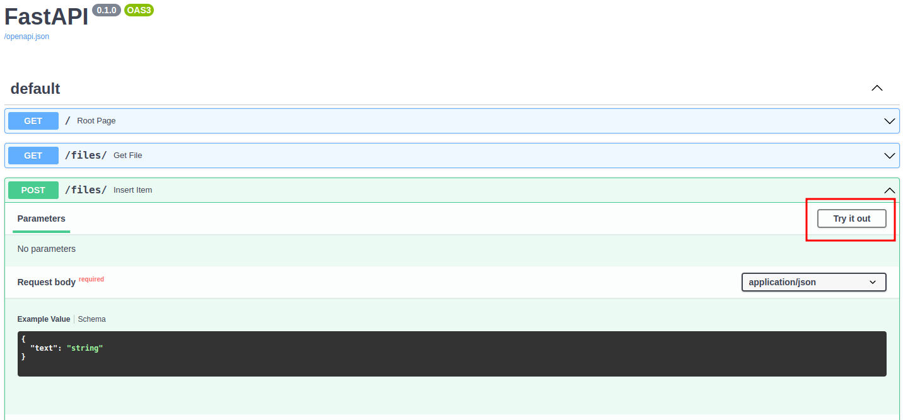

# Instructions

Hello everyone. To run this demo application you need:

- [docker](https://docs.docker.com/engine/install/)
- [docker-compose](https://docs.docker.com/compose/install/)

Once you have installed these prerequisites, go to the root directory of this project and run the following in your terminal:

```bash
docker-compose up
```

Afterwords, open your favorite browser and got to [http://127.0.0.1:8000/docs](http://127.0.0.1:8000/docs).

To test an API, click on it and then click on the _Try it out_ button:

<p align="center">
  
</p>

## Furthere details

To complete this task, I leveraged the [elasticsearch](https://www.elastic.co/elasticsearch/) no-sql database, and the [fastAPI](https://fastapi.tiangolo.com/)
web framework.

## Unittests

The demo comes with some basic unittests in the tests/ folder, which I used to check the correctness of I/O operations to elasticsearch.

Further tests should be implemented to check API responses against various, possibly wrong, input.

To run them, you need to have install the python virtual env with the dev dependencies too.

## Documentation

Although I did provide a docs/ folder to document the code via [sphinx](https://www.sphinx-doc.org/en/master/), for time reasons I did not write the docstrings of the functions,
hence the documentation would be empty, and I did not generate it.
